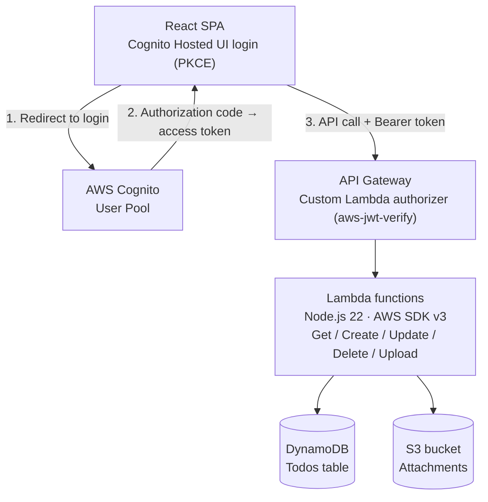

# AWS Serverless Todo API

[](https://github.com/stacknerdjoe/aws-serverless-todo-api/actions/workflows/test.yml)
[](https://github.com/stacknerdjoe/aws-serverless-todo-api/actions/workflows/deploy.yml)

A serverless REST API for managing todos with file attachments, built on AWS Lambda, API Gateway, DynamoDB, and S3, with AWS Cognito handling authentication. I deploy it with the Serverless Framework, test it with Jest, and ship changes through a GitHub Actions pipeline that runs the test suite on every pull request and deploys automatically once changes land on `main`.

It started from a course-provided TODO scaffold; the authentication, AWS SDK, error handling, and CI/CD here are an independent rebuild.

## Architecture



Every request to the API carries a Cognito access token. A custom Lambda authorizer verifies it against the user pool using `aws-jwt-verify` before API Gateway routes the request anywhere else, so none of the five application functions ever run against an unauthenticated or tampered request.

## Data model

Each todo item has:

- `todoId` — a unique id, generated server-side
- `userId` — the Cognito subject the item belongs to, extracted from the access token
- `createdAt` — when the item was created
- `name` — the todo's name
- `dueDate` — when it's due
- `done` — completion status
- `attachmentUrl` *(optional)* — set only once a file upload has actually been initiated for that item, not guessed in advance

## Functions

- **Auth** — custom API Gateway authorizer. Verifies the Cognito access token's signature and claims with `aws-jwt-verify`, and denies the request before it reaches any other function if the token is missing, expired, or invalid.
- **GetTodos** — returns every todo belonging to the calling user.
- **CreateTodo** — creates a new todo for the calling user. No `attachmentUrl` is set at creation time.
- **UpdateTodo** — updates a todo's name, due date, or done status. Uses a DynamoDB conditional write so an id that doesn't exist, or belongs to a different user, returns a clean 404 instead of silently succeeding or crashing.
- **DeleteTodo** — deletes a todo, with the same ownership check as update.
- **GenerateUploadUrl** — generates a presigned S3 PUT URL for an attachment, and writes the permanent object URL onto the todo at the same time, so `attachmentUrl` only ever points at something that's actually being uploaded.

## Endpoints

| Method | Path |
|---|---|
| GET | `https://va7t55fjv6.execute-api.eu-north-1.amazonaws.com/dev/todos` |
| POST | `https://va7t55fjv6.execute-api.eu-north-1.amazonaws.com/dev/todos` |
| PATCH | `https://va7t55fjv6.execute-api.eu-north-1.amazonaws.com/dev/todos/{todoId}` |
| DELETE | `https://va7t55fjv6.execute-api.eu-north-1.amazonaws.com/dev/todos/{todoId}` |
| POST | `https://va7t55fjv6.execute-api.eu-north-1.amazonaws.com/dev/todos/{todoId}/attachment` |

## Lambda functions

- `todo-app-dev-Auth`
- `todo-app-dev-GetTodos`
- `todo-app-dev-CreateTodo`
- `todo-app-dev-UpdateTodo`
- `todo-app-dev-DeleteTodo`
- `todo-app-dev-GenerateUploadUrl`

## Tech stack

**Backend**: TypeScript, AWS Lambda (Node.js 22), API Gateway, DynamoDB, S3, AWS Cognito, Serverless Framework
**Frontend**: React, TypeScript, `react-oidc-context`
**Testing**: Jest, `aws-sdk-client-mock`, 100% statement/branch/function/line coverage on the data and business logic layers
**CI/CD**: GitHub Actions

## Demo


## Deploy backend

```
cd backend
npm install
npm test
npx serverless deploy
```

Requires AWS credentials configured locally, and a Cognito User Pool and App Client already created — see `serverless.yml` for the environment variables it expects.

## Deploy frontend

```
cd client
npm install
npm start
```

Requires a `.env` file in `client/` with:

```
REACT_APP_COGNITO_AUTHORITY=...
REACT_APP_COGNITO_CLIENT_ID=...
REACT_APP_REDIRECT_URI=...
REACT_APP_API_ENDPOINT=...
```

## Testing

```
cd backend
npm test
```