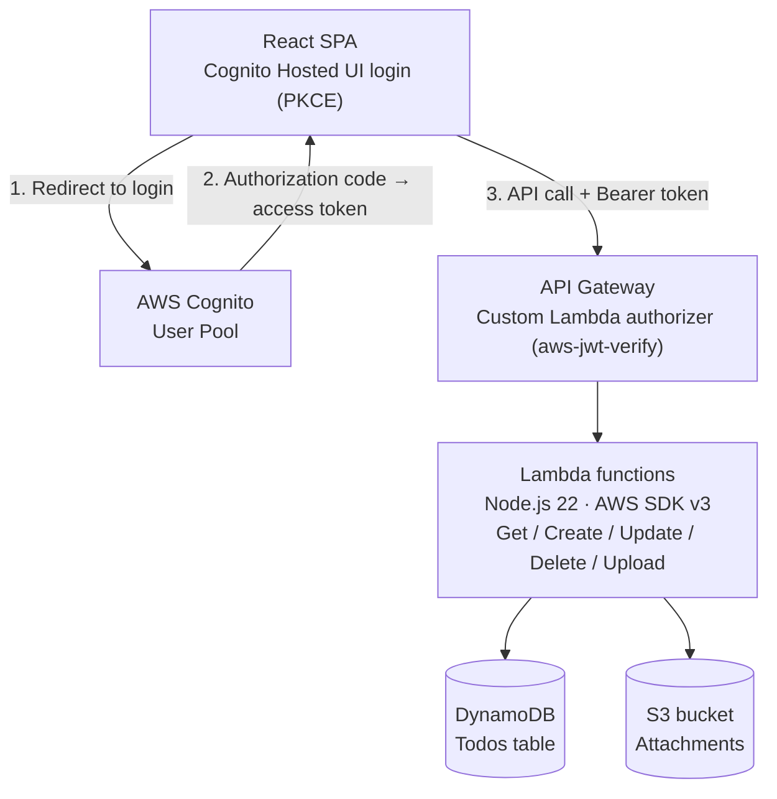
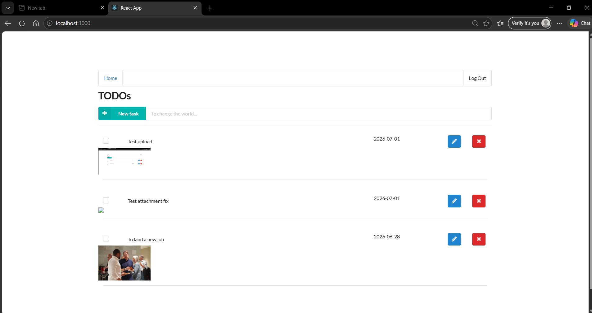

# AWS Serverless Todo API

[](https://github.com/stacknerdjoe/aws-serverless-todo-api/actions/workflows/test.yml)
[](https://github.com/stacknerdjoe/aws-serverless-todo-api/actions/workflows/deploy.yml)

A serverless REST API for managing todos with file attachments, built on AWS Lambda, API Gateway, DynamoDB, and S3, with authentication through AWS Cognito. Deployed with the Serverless Framework, tested with Jest, and shipped through a GitHub Actions pipeline.

## Architecture



## What changed from the original scaffold

This project started from a course-provided serverless TODO scaffold. Rather than deploy it as-is, I rebuilt the parts that mattered most:

- **Authentication**: moved from Auth0 to AWS Cognito, using a custom Lambda authorizer with `aws-jwt-verify` on the backend and `react-oidc-context` on the frontend, with the authorization code + PKCE flow rather than the older implicit grant.
- **Runtime and SDK**: upgraded from the deprecated `nodejs12.x` runtime to `nodejs22.x`, and migrated from AWS SDK v2 to the modular v3 clients (`@aws-sdk/client-dynamodb`, `@aws-sdk/lib-dynamodb`, `@aws-sdk/client-s3`, `@aws-sdk/s3-request-presigner`).
- **Error handling**: every handler now has proper try/catch with correct status codes (401 for missing/invalid auth, 400 for malformed input, 404 for a todo that doesn't exist or belong to the caller), instead of unhandled 502s on bad input.
- **A real bug fix**: the original code set a todo's `attachmentUrl` at creation time, before any file had been uploaded, pointing at an S3 object that might not exist. It's now only set once an upload is actually initiated.
- **Tests**: a Jest suite covering the data layer (mocked with `aws-sdk-client-mock`) and business logic layer, including a regression test that specifically guards against the attachment bug above reappearing.
- **CI/CD**: GitHub Actions runs the test suite on every pull request, and deploys automatically via the Serverless Framework on every push to `main`, gated on tests passing first.

## Tech stack

**Backend**: TypeScript, AWS Lambda (Node.js 22), API Gateway, DynamoDB, S3, AWS Cognito, Serverless Framework
**Frontend**: React, TypeScript, `react-oidc-context`
**Testing**: Jest, `aws-sdk-client-mock`
**CI/CD**: GitHub Actions

## API

| Method | Path | Description |
|---|---|---|
| GET | `/todos` | List all todos for the authenticated user |
| POST | `/todos` | Create a new todo |
| PATCH | `/todos/{todoId}` | Update a todo's name, due date, or done status |
| DELETE | `/todos/{todoId}` | Delete a todo |
| POST | `/todos/{todoId}/attachment` | Get a presigned URL to upload an attachment |

All endpoints require a valid Cognito access token in the `Authorization` header.

## Screenshots



## Running this yourself

**Backend:**
```
cd backend
npm install
npm test
npx serverless deploy
```
Requires AWS credentials configured locally, and a Cognito User Pool and App Client already created — see `serverless.yml` for the expected environment variables.

**Frontend:**
```
cd client
npm install
npm start
```
Requires a `.env` file with `REACT_APP_COGNITO_AUTHORITY`, `REACT_APP_COGNITO_CLIENT_ID`, `REACT_APP_REDIRECT_URI`, and `REACT_APP_API_ENDPOINT` set to your own deployed values.

## Testing

```
cd backend
npm test
```
100% statement, branch, function, and line coverage on the data and business logic layers.